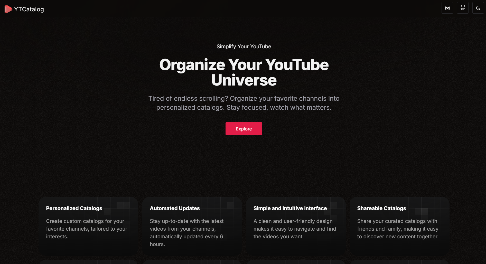

<h1 style="text-align: center;">YTCatalog: Organize Your YouTube Experience</h1>

Do you ever find yourself lost in a YouTube wormhole, spending hours watching unrelated videos? YTCatalog is here to help!

This web application empowers you to take control of your YouTube viewing by creating personalized catalogs of your favorite channels. Organize and curate content from channels you find valuable, making it easy to find the videos you want to watch later.

### Key Features:

- **Channel Catalog Creation:** Effortlessly build a list of YouTube channels you enjoy. Add them to your catalog for quick access.
- **Automatic Updates (Every 4 Hours):** Stay informed! YTCatalog automatically refreshes your catalog every 4 hours upon revisiting the page.
- **Seamless Sharing:** Share your curated catalogs with friends, family, or online communities who share your interests.

### Benefits:

- **Save Time:** No more aimlessly scrolling through YouTube's recommendations. Find the videos you're truly interested in quickly.
- **Stay Updated:** Never miss a new video from your favorite channels again.
- **Organize and Share:** Keep your YouTube viewing organized and share your curated selections with others.

# How to run the project locally

- Make sure you have git and node.js version >= 18+ installed on your system.
- Clone the repository
- Rename the `.env.example` to `.env.local`
- Get YouTube Data API v3 key (free): https://console.cloud.google.com/apis/api/youtube.googleapis.com -> CREATE PROJECT -> Enable API -> Create Credentials -> Check Public Data -> Submit. Once the API Key is visible copy that and paste it in `.env.local`
- Install all the packages, `npm install`
- Install firebase tools package globally in the system, `npm i -g firebase-tools`
- Run the development server with firebase emulators enabled `npm run dev` or with seed data `npm run dev:seed`

# Contributing

If you have bare minimum experience in React 18+ / Next.js 14+ / TypeScript / TailwindCSS you could start contributing by:

- Creating issues, suggesting better UI/UX and application flow
- Creating PRs, reviewing the existing code

Get in touch with me on: https://x.com/@realChakrawarti

## Tech stack & docs links:

- Next.js v14: https://nextjs.org/docs/getting-started/installation
- Firebase (Auth & Firestore)
  - Firebase docs: https://firebase.google.com/docs
  - Firebase local emulator: https://firebase.google.com/docs/emulator-suite/install_and_configure
- Youtube Data V3 API: https://developers.google.com/youtube/v3/docs
- TypeScript: https://www.typescriptlang.org/
- Tailwind CSS: https://tailwindcss.com/
- shadcn/ui: https://ui.shadcn.com/
- v0: https://v0.dev/

## Development dependencies guides

Reference: https://mokkapps.de/blog/how-to-automatically-generate-a-helpful-changelog-from-your-git-commit-messages

- Commitlint: https://commitlint.js.org/

  - https://github.com/conventional-changelog/commitlint
  - https://github.com/angular/angular/blob/22b96b9/CONTRIBUTING.md#-commit-message-guidelines

- Husky: https://typicode.github.io/husky/
  - https://git-scm.com/docs/githooks
